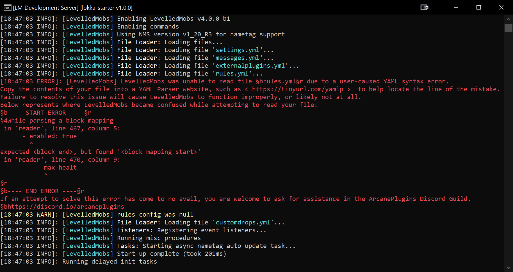

# 💢 Errors and Running LM

## Did you receive any of these common errors?

#### The YAML Mistake:

<figure><figcaption></figcaption></figure>

The most common of errors, the YAML typo. YAML is a very unforgiving language when it comes to syntax and spacing mistakes. What this message is telling you is that while attempting to load a file, in this case the `rules.yml`, there was an error in the syntax which made the file unreadable. It then notifies you of where the rules became unreadable to the program, while will help you identify the location of the error. We also recommend simply taking the contents of your unreadable file and checking it against a free online [YAML Checker \[ http://yamlchecker.com \]](https://yamlchecker.com/).

#### The Invalid Entry:

<figure><figcaption></figcaption></figure>

The second most common of errors, the invalid entry. While this does not affect every option, there are many which will inform you the operator via the console if there are any configuration options which include values which are invalid or unable to be processed by LevelledMobs. In some instances, an invalid value will not directly affect the functioning of the plugin; while in some instances an invalid value might disable certain features or the entire plugin.

#### The Missing Drop-Table

<figure><figcaption></figcaption></figure>

If you specify a rule using `apply-settings:` `use-droptable-id:`, and the table specified doesn't match a `drop-tables:` entry in the `customdrops.yml` file, then your console will be spammed by every instance where the table would have applied but couldn't because of the missing or invalid drop table name. We recommend either disabling the rule which applies the drop table, or replacing the table of the specified name.

### If your server startup looks like this:

<figure><figcaption></figcaption></figure>

### And performing a LevelledMobs reload looks like this:

<figure><figcaption></figcaption></figure>

### Then your server is likely ready to use LevelledMobs!

***

## Lets check for any Frequently Asked Questions.
