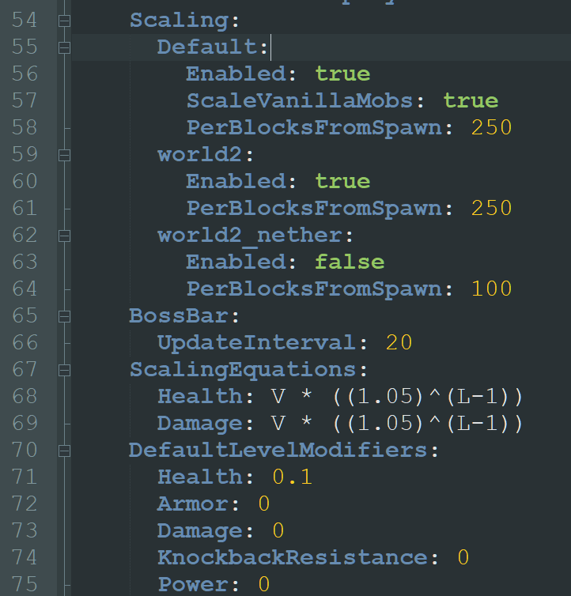

# 🗣️ FAQ

<details>

<summary>How do I enable or disable LevelledMobs in certain worlds, or for certain mobs?</summary>


```yaml
  conditions:
    worlds: ['*']
    #biomes: ['*']
    entities: ['*']
```


As part of the **Default Rule**, in your `rules.yml` file, locate the above configuration options.

You can edit what worlds are `included` or `excluded` by editing these settings.

For example, if you want to change it so that LevelledMobs works on _all worlds except for a world called `player_farms`_, then you'd change `worlds:` to read:


```yaml
worlds:
  excluded-list: ['player_farms']
```


For another example, if you wanted to change it so that LevelledMobs only works on the world called `danger_zone`, then you'd change `worlds:` to read:

```yaml
worlds:
  included-list: ['player_farms']
```

The same method can be used for _entities_.

</details>


<details>

<summary>Can LevelledMobs stop mobs from spawning?</summary>

**Never Has, Never Will**

This has been the policy of our plugin since it's earliest days of existence.

We have intentionally avoided any actions which affect the `mobQueue` or can change the spawning rate, mechanics, or behavior regarding the spawning of mobs. We recognized early on that this is the source of many conflicts between plugins working in similar fields and on the same or similar functions, conflicting with each other.

In general, the way LevelledMobs works is by employing a wide range of listener systems which are listening for things like chunk loads, entity spawns, damage events, etc. If LevelledMobs detects a mob it will first determine if that mob has finished 'spawning'. If it has, then it will determine whether that mob should receive a level based on the current ruleset. If it does, then LevelledMobs will store a large amount of data onto the mob itself which contains much of the settings which LevelledMobs uses to identify and modify the entites. If the entity is not allowed to be levelled, whatever the reason, then that entity will have most of LevelledMobs' data removed and it will be ignored by the plugin until such time that it becomes levellable (due to a change in the rules or environment/condition check).&#x20;

</details>


<details>

<summary>Will LevelledMobs make my server lag?<br>My Spark/Profiler Report said your plugin is using a lot of resources?!</summary>

Incredibly unlikely!

Even with servers running very thin resource margins, we have had little issue with regards to lag. We also maintain relationships with a few server owners using our plugin whose player counts ranges from 50-400, and the receipts from these live tests show our plugin is highly performant under typical and atypical server environments.\
\
With each major update we perform a stress-test which covers the nametag, custom drops, and strategy calculating systems; the three highest-price resources we utilize. Even under uncommon situations where several thousand mobs exist in a small field of chunks visible to multiple players, each processing a unique level strategy and a choosing from a set of randomly damaged armors, there was no noticeable increase in lag or TPS drops.

Specific to Spark and Profiler reports; these are almost always a misunderstanding of what the report is actually saying. I cannot remember a case in four years of development where a single report brought to our attention by the general public was representative of a valid concern. If you possess the knowledge-base necessary to analyze these reports, we encourage you to report any issues you may see. Otherwise, we ask that you check more appropriate areas for support regarding your server's performance issues.

</details>


<details>

<summary>What server software does LevelledMobs support?</summary>

Please read [Installation](installation.md).

</details>


<details>

<summary>Will LevelledMobs give players increased XP or Items?</summary>

Yes!

By default, this increase is set to 300% for items and 500% for xp when at the max level of a mob. These values can be changed in the config, removed entirely, or when combined with the **Death-in-Chunk Limiter**, put the feature on a cooldown.

Levelled mobs have increased health, damage output, and speed; making them a challenge worth rewarding with a bit of extra XP or Items. If you or your server disagree, you can edit any of the above mentioned values.

</details>


<details>

<summary>How do I remove nametags from passive mobs?</summary>

Locate the following custom rule in your default `rules.yml` file:


```yaml
  - enabled: true
    name: 'Mobs with Modified Nametag Visibility'
    conditions:
      entities:
        included-groups: [ 'all_passive_mobs' ]
        included-list: [ 'BAT' ]
    settings:
      nametag-visibility-method: [ 'MELEE', 'ATTACKED' ]
```


And change the _nametag visibility method_ to read `nametag-visibility-method: DISABLED`

This will disable the nametag feature for all passive mobs, plus bats (as they are strangely not considered Passive by Minecraft's standard).

</details>


<details>

<summary>How do I change the drops of a mob?</summary>

Use our [Custom Drops](../the-default-files/customdrops.yml/) system!

The Custom Drops feature provides an easy to use, easy to scale config allowing you to create lists or tables of items to apply to mobs. These items can be set as drops, as wearable equipment, or usable items placed in the mobs' hands. You can reward players with commands, with items from several supported 3rd party plugins, with vanilla items and more; adjusting the output based on any number and combination of factors.

It is recommended to use the Custom Drops system by creating Drop Tables, and then by implementing those Drop Tables via a Custom Rule. You can see an example in the Sample Custom Rules.

</details>


<details>

<summary>What levelling strategies are available?</summary>

With LevelledMobs4, you can combine multiple levelling _strategies_ together to form a final numerical level value, or use each strategy on an individual basis.

* **Weighted Random** (enabled by default)\
  Uses a random selection method, where the highest level possible has the lowest chance to occur and the lowest level possible has the highest chance to occur.\
  This can be modified to set level specific weights to the random selection.
* **Random**\
  This is true random levelling. Any level between the minimum and maximum can be selected.
* **Distance-from-Origin**\
  Previously _distance-from-spawn_, this strategy allows you to establish a center-point, and ever expanding rings from that point will gradually increase the level value of mobs based on your distance settings. The _blended_ addon from LM3 was incorporated into the main setting with LM4, allowing for the height above or below a certain threshold to affect the final output number (by default, higher values in the caves, lower values in the mountains). Useful for a more expansive world like the End.
* **Y-Coordinate** (enabled by default)\
  This strategy takes a starting world height and sets the lowest level available at that height and higher, then takes the ending world height and sets the highest level available at that height and lower. Useful for a more vertical world like the Nether.

As well, as have multiple _modifiers_ which can apply an additional metric to adjust the final applied level to a mob.

* **Player Level Modifier** (enabled by default)\
  Previously the strategy _player-variable-levelling_, this modifier can take the PlaceholderAPI \[PAPI] placeholder tags produced by other 3rd party plugins, as well as a handful of our own internal placeholders, and combine them to form a numerical basis to adjust the level of mobs.&#x20;
* **Random Variance Modifier** (enabled by default)\
  This modifier simply selects a random number between the established values; useful for applying a random degree of variance to final applied levels.

</details>


<details>

<summary>How do I change the difficulty of mobs?<br>The mobs are too hard?!</summary>

We provide five unique and play-tested levelling _Challenges_ that you can easily shift between.

```yaml
    #===== Choose a Challenge =====
    #- challenge-vanilla
    #- challenge-bronze
    - challenge-silver
    #- challenge-gold
    #- challenge-platinum
    #- challenge-formula
```

By default, we use the _Silver Challenge_. You can shift up to the _Bronze_ challenge for a reduced difficulty, or down to the _Gold_ or _Platinum_ challenge which requires skill to handle.\
Or you can craft your own _Challenge_ **Preset** by copying any of the other presets and giving it a unique name, then altering the attribute values to suit your servers' needs.

</details>


<details>

<summary>How do I change to a different levelling strategy?</summary>

With LevelledMobs4, you can combine multiple levelling _strategies_ together to form a final numerical level value, or use each strategy on an individual basis.

Each _strategy_ produces it's own placeholder tag representing the output from that strategy. For example, the strategy type _distance-from-origin_ produces an internal-use placeholder tag `%distance-from-origin%` which outputs the numerical value of that _strategy_.&#x20;

Under the **Default Rule**, we include several presets which can be easily enabled or disabled to activate or deactivate different strategies.


```yaml
    #===== Choose Strategies =====
    #- lvlstrategy-random
    - lvlstrategy-weighted-random
    #- lvlstrategy-distance-from-origin
    - lvlstrategy-y-coordinate

    #===== Choose Modifiers =====
    - lvlmodifier-player-variable
    - lvlmodifier-random-variance
```


Simply remove or add in the `#` to enable or disable the different _strategy_ presets.&#x20;

Once you've settled on your strategies, locate the `construct-level:` under the **Default Rule** and modify it to only include the activated strategies and how you'd like those strategies' output to be reflected.


```yaml
construct-level: '(%weighted-random% / 2) + (%y-coordinate% / 5) + %player-variable-mod% + %random-variance-mod%'
```


For example, if I had only left `lvlstrategy-weighted-random` and `lvlmodifier-random-variance` enabled, then I might change the `construct-level:` to reflect that change:


```yaml
construct-level: '(%weighted-random% / %random-variance-mod%) + %random-variance-mod%'
```


</details>


<details>

<summary>How can I make a mob from plugin X levelled?</summary>

With LevelledMobs4, we include the new `externalplugins.yml` file. This allows you to establish your own external plugin support by providing commonly used plugin-specific identifiers within a mobs PersistentDataContainer \[PDC] or it's Metadata.&#x20;

</details>


<details>

<summary>How can I translate the names of mobs?</summary>

All mobs using their default names will have those names automatically translated to the language set by the Minecraft client the player is using, meaning every player may see the default names differently based on their set language settings.

If this is not enough, we also include the `entity-name-override:` setting which allows you to specify certain mob types and provide a randomly selected series of names for these mob types to be given. While these cannot be automatically translated, it does allow for unique varieties of the same mob by a simple name change.

</details>


<details>

<summary>How can I increase an attribute above 2048?</summary>

LevelledMobs does not limit this value, it's your server software.

In the `spigot.yml` of your servers' software files, locate this section:

```yaml
  attribute:
    maxHealth:
      max: 2048.0
    movementSpeed:
      max: 2048.0
    attackDamage:
      max: 2048.0
```

We recommend changing these values to a higher number.

NOTE: Minecraft's programming isn't designed to handle exceptionally large numbers. We recommend limiting your increase to `max: 1000000.0` . Higher values can cause crashes and other unexpected results.

</details>


<details>

<summary>MythicMobs entities not levelling properly?<br>VanillaMobs.yml in MythicMobs</summary>

Around MythicMobs version 5.2.6 there was a change made in the default configuration of the MythicMobs installation which enables by default the scaling/levelling of entities via their own mechanics that are entirely separate from LevelledMobs. LevelledMobs detects a fully created entity and then applies levels to that entity; if MythicMobs' has their scaling system active that will mean they will start with varied and increasing stats before LevelledMobs even has a chance to adjust them.

In order to reset entities to their vanilla stat values, you could disable the scaling system within MythicMobs to use LevelledMobs' levelling exclusively, or vice-versa (of course we recommend using ours over theirs but it's your choice!). To disable, locate the `config.yml` file in your MythicMobs' installation, and set the `Enabled:` under each respective worlds/scenarios to `false` to disable the scaling of MythicMobs for those scenarios. You can also adjust the Modifiers themselves to allow for some scaling controlled by MythicMobs.



</details>


## No questions? We recommend heading over to the next wiki section:


[understanding-the-modular-rules-system.md](../the-default-files/understanding-the-modular-rules-system.md)


***
